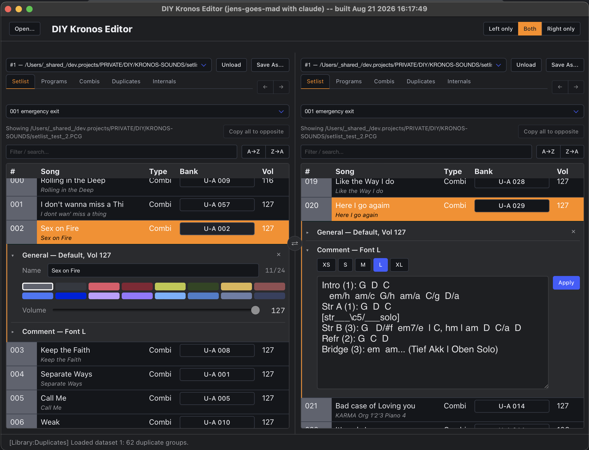
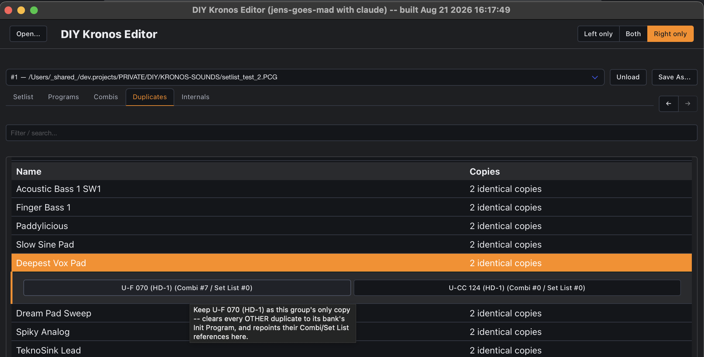

# DIY Kronos Editor

[](https://github.com/jens-goes-mad/DIY-KORG-KRONOS-EDITOR/actions/workflows/native-build.yml)

A cross-platform, cross-architecture editor for Korg Kronos `.PCG`/`.SNG`
backup files, built on [CHOC](https://github.com/Tracktion/choc)
(HTML/JS/CSS UI over a thin native C++ bridge) -- same stack as the sibling
`DIY-MIDI-METRONOME/EDITOR` project, reused rather than reinvented.



## Download

Prebuilt binaries, one per platform (unsigned -- see [Build](#build) below if your OS
blocks it and you'd rather not build from source):

- [macOS (Apple Silicon)](https://github.com/jens-goes-mad/DIY-KORG-KRONOS-EDITOR.public/releases/latest/download/kronos_editor-macos-arm64.zip)
- [macOS (Intel)](https://github.com/jens-goes-mad/DIY-KORG-KRONOS-EDITOR.public/releases/latest/download/kronos_editor-macos-x86_64.zip)
- [Linux (x86_64)](https://github.com/jens-goes-mad/DIY-KORG-KRONOS-EDITOR.public/releases/latest/download/kronos_editor-linux-x86_64.zip)
- [Windows (x86_64)](https://github.com/jens-goes-mad/DIY-KORG-KRONOS-EDITOR.public/releases/latest/download/kronos_editor-windows-x86_64.exe)

These always point at the newest [release](https://github.com/jens-goes-mad/DIY-KORG-KRONOS-EDITOR.public/releases) --
built and attached automatically by `.github/workflows/native-build.yml` on every
version tag push (`git tag vX.Y.Z && git push --tags`). The macOS/Linux downloads are
`.zip` (unzip it, then run the `kronos_editor` inside -- a raw executable loses its
"you're allowed to run this" bit over a plain HTTP download, which a zip preserves).

**macOS specifically**: since the app isn't signed/notarized, the first launch needs
**right-click -> Open** (not a plain double-click) so Gatekeeper offers an "Open Anyway"
choice instead of just refusing -- only needed once per download.

## Why this exists

Korg never published a spec for the container/chunk structure the Kronos's
`.PCG`/`.SNG` backup format is built from -- that part is entirely
reverse-engineered here, though Korg's own SysEx documentation (describing
individual objects like Programs/Combis/Set Lists) is used as a real
cross-check wherever it exists. Managing a real Kronos's library -- years of
accumulated duplicate Programs, Set Lists scattered across gig backups, no
easy way to compare two backups side by side -- means doing it entirely by
hand on the unit's own screen, or not at all. This project is
reverse-engineering that format from scratch, byte by byte, verified against
real backup files with known ground truth (not guessed), and building a real
cross-platform editor on top of it as the findings land -- full writeup and
reference at **[the docs site](https://jens-goes-mad.github.io/DIY-KORG-KRONOS-EDITOR.public/overview)**
(source: [`docs/content/format/index.md`](docs/content/format/index.md)).

**If you own a Kronos**, the browsing/rearranging features below already work
on real backups today, and every additional confirmed field or fixed Set List
name is real progress on a format nobody else has fully documented.
**If you're a developer** curious about reverse-engineering a real binary
format, building a cross-platform native+web UI, or both, the codebase is
built specifically to lower that bar -- see
[App architecture & components](https://jens-goes-mad.github.io/DIY-KORG-KRONOS-EDITOR.public/components/)
for how small, independently testable pieces let you contribute to one part
without building the whole native app first. `STATE.md` tracks exactly
what's built, what's verified, and every known blind spot/open question --
that's the place to look for where a contribution would actually help right
now (Drum Kits/Wave Sequences/Global settings are still completely
unexplored; Windows/Linux native file dialogs are an honest stub; the
write-back/encoder side barely exists yet).

**Tools/stack**: C++ (CMake), [CHOC](https://github.com/Tracktion/choc) for
the native window/WebView bridge, plain vanilla JS/HTML/CSS on the frontend
(no bundler, no build step in dev -- open `frontend/index.html` in a
browser tab with `mock_bridge.js`'s fake data and iterate without compiling
anything), [Bulma](https://bulma.io) (vendored, CSS-only) for layout/styling,
a scoped `ctest` target plus headless `node`-runnable tests for the
byte-level parsing logic, and GitHub Actions CI building macOS
(arm64+Intel), Linux, and Windows on every relevant push.

Feel free to support the project by sending ideas, bug reports, or pull
requests -- any of it helps.

First iteration scope (see `STATE.md` for current status):

1. Open a `.PCG` file via a native Open dialog and extract all 128 Set Lists
   into memory as a **dataset**.
2. Pick one Set List per pane and show its 128 song slots, with filter/search.
3. A Norton-Commander-style dual pane to copy songs between Set Lists, and
   swap/reorder songs within one, both via drag and drop.

Edits happen in memory, but as of Program drag-and-drop and the Setlist
Comment/Color/Volume/Font size editors (see `STATE.md`) that increasingly
means directly into a loaded file's own retained raw bytes, not just
app-level bookkeeping layered on top of them -- which is also, now, always
what actually ends up on disk: a `saveFileAs(datasetId, path)` bridge method
writes that same retained buffer straight to a file. There's no Save UI yet
(no dialog, no dirty-tracking, no keyboard shortcut) -- for now it's a
building block, first exercised by a devtools-console script
(`tools/generate_setlist_test_matrix.js`) that generates a matrix of
Setlist edits for checking against real Kronos hardware.

## Datasets: one loaded file, decoupled from which pane shows it

Each opened `.PCG` file becomes its own **dataset**, identified by an id the
native bridge mints on open (not by which pane opened it -- there's a single,
global Open button, not a per-pane one). Each pane has its own selector to
pick *which already-open dataset* to display, shared by all of that pane's
categories (Setlist/Programs/Combis/Duplicates, see below) -- independent of
the other pane. This covers two different workflows with one mechanism
instead of two UI modes:

- **Rearranging one backup** (e.g. building a new gig Set List from songs
  spread across other Set Lists in the same file): point both panes at the
  *same* dataset. Since they're then both reading/writing the one shared
  in-memory file, an edit made via either pane is immediately visible in the
  other.
- **Merging/comparing two different backups**: drop a second file -- it
  becomes a second, fully independent dataset -- and point each pane at a
  different one. Dragging a row between them still works exactly the same
  way, just copying across datasets instead of within one.

Opening a path already open elsewhere reuses that existing dataset instead of
loading a second copy; otherwise opening always creates a *new* dataset, and
never silently overwrites whatever a pane was already showing. See
`docs/content/components`'s Datasets section and `STATE.md`'s "ARCHITECTURE"
block for the full before/after and why this replaced the old
one-file-per-pane model.

## Per-pane categories: Setlist / Programs / Combis / Duplicates / Internals

Each pane has its own category navbar, not a separate top-level tab -- so two
panes can independently show different categories of the same dataset, the
same category of two different datasets side by side, or anything in
between.

- **Setlist**: the 128-slot browsing/filtering/drag-and-drop described above,
  plus a Bank-jump button per slot that switches that same pane to
  Programs/Combis and scrolls straight to the exact entry it points at. Each
  slot has one editor panel (click #, Vol, or Song/Type to open it) with a
  collapsible section per field -- Color, Volume, Comment+Font size -- several
  can be expanded at once, and one Close button dismisses the whole panel.
  Color/Volume commit immediately; Comment+Font size via Apply. If both panes
  point at the same Set List of the same dataset, editing a slot already open
  in the other pane is blocked (with an explanatory popup) rather than
  risking one edit silently overwriting the other's -- see
  [App architecture & components](https://jens-goes-mad.github.io/DIY-KORG-KRONOS-EDITOR.public/components/)
  for exactly how that's implemented.
- **Programs / Combis / Duplicates**: browse every Program and Combi on the
  unit directly (not just through Set List slots), filter by bank (a
  None/All/Invert row bulk-toggles the bank filter), see which Set List slots
  directly reference a given Program, and find Programs that are byte-for-byte
  duplicates of each other. Read-only -- this is Phase 1 of a larger plan
  (see `STATE.md`'s "Program/Combi Library Editor" section) that eventually
  aims to delete unused duplicates and repoint Combis at a single kept copy;
  that part needs a currently-unparsed piece of the format (a Combi's
  internal Timbre-to-Program references) and a safe write-back mechanism
  this app has never had, so it's deliberately not built yet.
- **Internals**: read-only diagnostics showing which top-level chunks and
  which Program/Combi banks a dataset actually contains -- since a backup
  tool that lets you choose what to save could plausibly omit banks, with
  nothing else in the app able to tell you. Building it surfaced a real gap:
  every bank "index" this project uses anywhere is just that bank's position
  among however many bank sub-chunks were found in the file, not a confirmed
  identity tied to the bytes themselves -- see the file format doc's open
  questions for the details. The pane reports how many of the expected banks
  were found without claiming to know which specific bank is missing.
  Resetting one Program slot to its bank's factory Init Program is built
  (right-click a row in the Programs table -- "Reset entry"); a whole-bank
  bulk init isn't, and Combi-side reset needs a real Init-Combi byte capture
  off hardware first (only Init-Program bytes exist in `resources/` so far).




## The KORG PCG/SNG file format

Everything about the file format -- container structure, the Set List
name and per-slot parameter layout, the Program/Combi instrument-name
cross-reference, verification evidence, and the full list of remaining
unknowns -- is documented in
**[`docs/content/format/index.md`](docs/content/format/index.md)**
(also at [the docs site](https://jens-goes-mad.github.io/DIY-KORG-KRONOS-EDITOR.public/format)).
Korg has never published a spec for the container/chunk format itself; that
document is the complete internals reference this project's parser
(`src/kronos/PcgFile.cpp`) is based on.

## Opening a file

Each pane has an **"Open..." button** next to its dataset selector. Clicking it
calls `openFileDialog` -> a real native file picker (`NSOpenPanel` on macOS,
via `src/platform/NativeFileDialog.cpp`), invoked *directly* rather than
through Choc's own WebView-triggered picker (see the bug writeup below for why
that distinction matters). Once a path is chosen, the bridge reads it with a
plain `std::ifstream` (`PcgFile::load(path)`), mints a new dataset id, and
returns it -- see "Datasets" above. Opening a path that's already open (exact
match against the dataset's `displayName`) reuses the existing dataset instead
of loading a second copy, and reports this back as `alreadyOpen: true`.

Drag-and-drop-to-open (an earlier workaround, described below) has since been
**removed** now that the native dialog works. The Setlist table's own
row-level drag-and-drop (dragging a song between panes to swap/copy entries)
is a separate, unrelated feature and is unaffected.

The native dialog exists specifically because of a bug found in earlier manual
testing, which is why drag-and-drop was the *only* UI mechanism for a while:

**A plain HTML `<input type="file">` does trigger a real native file picker
(NSOpenPanel on macOS) inside the Choc WebView** -- confirmed by adding one
directly to `index.html` for testing. `choc_WebView.h`'s
`webView:runOpenPanelWithParameters:...` delegate method does the textbook-
correct thing (`beginSheetModalForWindow:` attached to the WKWebView's own
window), but in practice **the resulting sheet appears behind the main app
window** rather than in front of it, making it unusable. The fix: rather than
going through that delegate at all, `NativeFileDialog.cpp` calls `NSOpenPanel`
directly via `choc::objc` and uses `runModal` (app-modal, not attached to any
window) instead of the sheet-based `beginSheetModalForWindow:` -- a genuinely
different code path that sidesteps the z-order bug entirely. Confirmed working
in the real app. See STATE.md's "NATIVE FILE DIALOG + PROGRESS" section and
Blind Spot #11 for the full history.

Currently macOS-only; Windows/Linux `NativeFileDialog.cpp` is an honest stub
returning "unsupported" rather than untested guesswork.

Known limitation: the whole file is read into memory in one shot with no
progress reporting yet -- fine for occasional loads, but there's no percentage
indicator during a large import (only an indeterminate spinner). A
chunked-read-with-progress design (background thread + `postMessage`/
`evaluateJavascript` push events) is written up in STATE.md but not built yet.

## Build

Builds on macOS (arm64 + Intel), Linux, and Windows -- verified via CI
([`.github/workflows/native-build.yml`](.github/workflows/native-build.yml)),
one CMake project, no per-platform source trees (CHOC maps to WebKit/
WebKit2GTK/WebView2 depending on the OS). Full requirements and
platform-specific notes: **[docs/content/building](docs/content/building/index.md)**
(also live at [the project site](https://jens-goes-mad.github.io/DIY-KORG-KRONOS-EDITOR.public/building/)).

```sh
cmake -B build -DCMAKE_BUILD_TYPE=Debug
cmake --build build
./build/kronos_editor
```

Debug builds read `frontend/` live off disk (edit-reload friendly). Release
builds (`-DCMAKE_BUILD_TYPE=Release`, or `-DEDITOR_EMBED_RESOURCES=ON`)
embed `frontend/` and `resources/` into the binary via `tools/embed_resources.py`, and on
macOS produce a real `build/kronos_editor.app` bundle instead of a bare executable (see
[docs/content/building](docs/content/building/index.md) for exactly where each platform's
build output ends up).

This repo has one optional, private companion submodule
(`private/diy-korg-kronos-editor`, see `STATE.md`) for functionality out of scope for
this public project -- it's never required: a plain `git clone` (no
`--recurse-submodules`) builds and runs `kronos_editor` exactly the same, just without
whatever that submodule adds. If you have access to it, `git submodule update --init`
pulls it in.

**Don't want to build locally?** See [Download](#download) above for prebuilt binaries.
For a one-off build of an arbitrary commit (not a tagged release), the native-build
workflow can also be triggered manually (`workflow_dispatch`) from the Actions tab --
[Actions -> Build Kronos Editor (native) -> Run
workflow](https://github.com/jens-goes-mad/DIY-KORG-KRONOS-EDITOR.public/actions/workflows/native-build.yml).
Once the run finishes, its summary page lists 4 downloadable artifacts, one per
platform: `kronos-editor-macos-arm64`, `kronos-editor-macos-x86_64`,
`kronos-editor-linux-x86_64`, `kronos-editor-windows-x86_64` -- unlike the tagged
Download links above, these need a GitHub login and expire after 90 days.

## Testing

```sh
# C++: scoped to just the format-parsing code (no CHOC/WebView build needed)
cmake --build build --target pcg_file_test
ctest --test-dir build -R pcg_file_test

# Frontend: headless, per-component
node frontend/components/kronos/setlist-editor-comment-and-font.test.js
```

See **[docs/content/components](docs/content/components/index.md)**'s "Committed,
headless test suites" section for how these fit alongside each component's
`.test.html` browser harness.

## Architecture direction

Both the frontend and backend are moving toward small, focused
decoder/encoder units instead of one big eager parse -- see
**[docs/content/components](docs/content/components/index.md)** (also
live at [the project site](https://jens-goes-mad.github.io/DIY-KORG-KRONOS-EDITOR.public/components/))
for the rationale, and `STATE.md`'s "ARCHITECTURE: DECODER/ENCODER
REFACTOR" section for the current decision and where it's headed next
(Program decoder first, then Combi, then Set List slot).

## Layout

```
docs/README.md                -- short pointer to docs/content/format/index.md below
docs/content/format/index.md  -- the full file-format internals reference (also the Hugo docs site)
docs/content/                 -- the public Hugo/GitHub Pages docs site
src/
  kronos/PcgFile.{h,cpp}     -- the file-format parser (implements docs/content/format/index.md)
  bridge/EditorBridge.{h,cpp} -- native functions exposed to the web UI
  platform/NativeFileDialog.{h,cpp} -- native Open/Save dialog (macOS; Windows/Linux stubbed)
  main.cpp                   -- CHOC window/webview wiring
frontend/
  index.html, app.js, style.css   -- topbar (global Open button) + shared wiring
  datasets.js                  -- shared dataset registry (open files, decoupled from pane) -- see Datasets above
  pane.js                      -- pane shell (dataset selector + Setlist/Programs/Combis/Duplicates/Internals category nav) + Setlist UI
  library.js                   -- Programs/Combis/Duplicates category content, embedded per-pane (not a separate tab)
  internals.js                 -- Internals category content: which chunks/banks a dataset contains, embedded per-pane
  mock_bridge.js              -- fake in-memory backend for plain-browser dev (no native build needed)
  vendor/bulma.min.css         -- vendored Bulma (CSS only, no JS/build-step dependency) -- see docs/content/components
  components/kronos/          -- standalone, byte-level-tested UI pieces (see Architecture direction above)
third_party/choc/            -- vendored from DIY-MIDI-METRONOME/EDITOR
```

## License

Source-available under the [PolyForm Noncommercial License 1.0.0](LICENSE) -- free to use,
modify, and share for any noncommercial purpose (personal, research, educational, hobby,
nonprofit). Not OSI "open source" in the strict sense: commercial use needs a separate
agreement first -- see [`LICENSE`](LICENSE) for how to ask.
