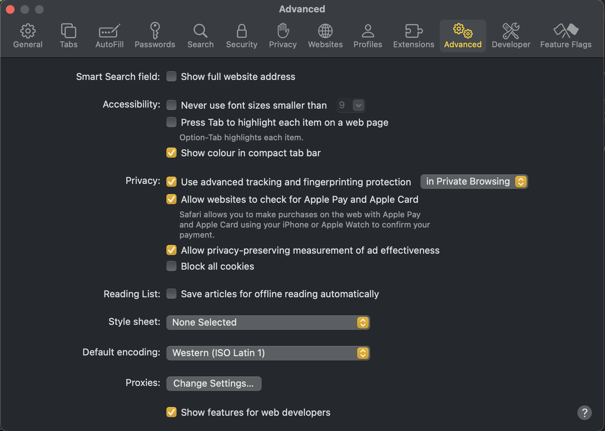
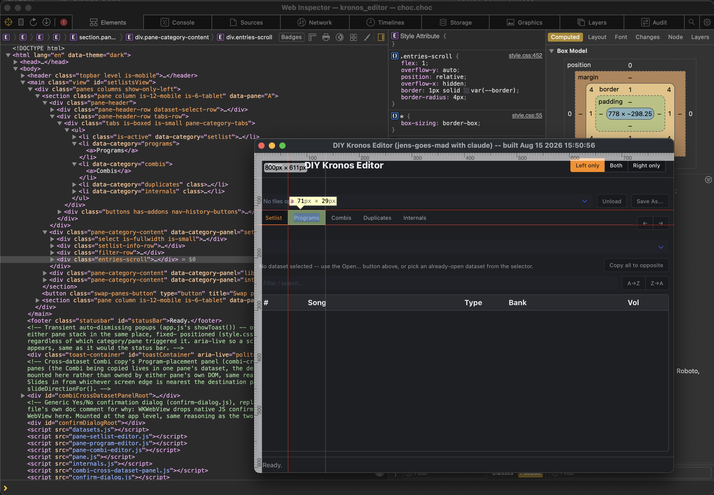

The editor is a single CMake project with no platform-specific source trees --
[CHOC](https://github.com/Tracktion/choc) provides one native-webview abstraction that
maps to WebKit (macOS), WebKit2GTK (Linux), or WebView2 (Windows) depending on what
`CMakeLists.txt` detects. As of this writing it's built and verified on all three via CI
(macOS arm64 + Intel, Linux x86_64, Windows x86_64) --
[`.github/workflows/native-build.yml`](https://github.com/jens-goes-mad/DIY-KORG-KRONOS-EDITOR/blob/main/.github/workflows/native-build.yml)
is the living, tested reference these instructions are drawn from.

## Requirements

| | macOS | Linux | Windows |
|---|---|---|---|
| Compiler | Xcode Command Line Tools (AppleClang) | GCC or Clang | Visual Studio 2022 (MSVC) |
| CMake | 3.21+ | 3.21+ | 3.21+ |
| WebView backend | WebKit + Cocoa (system frameworks, nothing to install) | `libgtk-3-dev` + `libwebkit2gtk-4.1-dev` + `pkg-config` | WebView2 (Evergreen runtime, preinstalled on current Windows 10/11) |
| Python 3 | only for Release builds (`embed_resources.py`) | only for Release builds | only for Release builds |

Linux dependency install (Debian/Ubuntu):

```bash
sudo apt-get update
sudo apt-get install -y libgtk-3-dev libwebkit2gtk-4.1-dev pkg-config
```

## Build

```bash
git clone https://github.com/jens-goes-mad/DIY-KORG-KRONOS-EDITOR.git
cd DIY-KORG-KRONOS-EDITOR
cmake -B build -S .
cmake --build build
```

That's a **Debug** build by default -- `frontend/` (the HTML/JS/CSS UI) is read live off
disk from the checked-out source tree at runtime, which is convenient while developing
(edit a file, reload the window, no rebuild needed) but means the binary isn't portable
on its own.

For a **Release** build -- `frontend/` gets embedded into the binary at compile time as
byte arrays (via `tools/embed_resources.py`, hence the Python 3 requirement above), so
the result is a single self-contained executable:

```bash
cmake -B build -S . -DCMAKE_BUILD_TYPE=Release
cmake --build build --config Release
```

The `--config Release` flag matters on Windows specifically: MSVC is a multi-config
generator, so the actual build configuration is chosen at build time, not at configure
time, even though `-DCMAKE_BUILD_TYPE=Release` is also needed at configure time (it's
what this project's own `CMakeLists.txt` checks to decide whether to embed resources at
all).

### Where the binary ends up

- macOS / Linux: `build/kronos_editor`
- Windows: `build/Release/kronos_editor.exe` (or `build/Debug/kronos_editor.exe` for a
  Debug build -- MSVC's multi-config generator puts each configuration in its own
  subfolder)

## Debugging, especially the JavaScript side

The editor's UI is plain HTML/JS/CSS running inside CHOC's native webview, and there are
three different ways to debug it depending on what you're actually chasing.

### Headless, per-component tests

For the pure `decode`/`encode` codec modules under `frontend/components/kronos/*.js` (no
DOM at all), run the headless test directly in Node:

```bash
node frontend/components/kronos/setlist-comment.test.js
```

### Plain-browser mode -- no native app at all

Open `frontend/index.html` directly in a real browser (or serve the `frontend/` folder,
e.g. `python3 -m http.server` from inside it). `frontend/mock_bridge.js` auto-detects that
there's no native bridge and fabricates Set Lists/Programs/Combis, so drag-and-drop,
filters, the Unload button, the cross-dataset copy panel, and so on can all be exercised
with completely unrestricted Chrome/Safari DevTools. This is the fastest loop for UI/logic
work that doesn't need real file data. The one thing it genuinely can't do is open a real
`.PCG`/`.SNG` file -- a plain browser page has no filesystem access, so "Open..." falls
back to a `window.prompt()` stub instead of a real file picker.

### Real DevTools attached to the running app

`main.cpp` already sets `options.enableDebugMode = true` on the `choc::ui::WebView`, which
CHOC wires up per platform and allows remote debugging.<br>

This gives you breakpoints, a live console, and the DOM inspector against the *real*
native bridge (`window.copyProgram`, `window.listDatasets`, actual file bytes) -- not
fabricated data. One gotcha: `console.log` inside the webview only goes to that DevTools
console, never to the terminal `kronos_editor` was launched from.

Combined with a Debug build reading `frontend/` live off disk (see "Build" above), this
means the normal edit loop for JS/CSS changes is: edit the file, reload the window
(Cmd+R/Ctrl+R works inside the webview), no C++ rebuild at all -- only changes under
`src/` need `cmake --build build` again.

#### **macOS**

Select: `Safari -> Preferences -> Show features for Web Developers`



Now start Safari and select: `Develop -> <YOUR MAC> -> Kronos Editor, choc.choc`<br>
And here you go: Full browser dev tools support. Just press CTRL+R to refresh the UI (CSS/JS/HTML), no build required. 



#### **Windows (WebView2)**

Same flag sets `AreDevToolsEnabled` -- **F12**, or `right-click
-> Inspect`, opens Chrome DevTools attached to the embedded WebView2.

#### **Linux (WebKitGTK)**

Do: `right-click -> Inspect Element` works the same way.

### Conclusion

Each of the per-component codec modules above also has a browser-based `.test.html`
harness (open it via a static file server) if you want to see the component actually
rendered. See [App architecture & components](/components)'s "Committed, headless test
suites" section for how the two fit together.

For most day-to-day JS bug hunting, DevTools attached to the real running app (above) is
the one to reach for: real data, real bridge, and a reload is all a JS edit needs.

## A note for contributors touching `main.cpp` on Linux

CHOC's `choc_DesktopWindow.h` uses GTK types (`GdkDragContext`, `GtkWidget`, ...) without
including `<gtk/gtk.h>` itself -- it relies on some other header having already pulled
that in. `choc_MessageLoop.h` and `choc_WebView.h` both do (under `#if CHOC_LINUX`), so
one of those **must** be included before `choc_DesktopWindow.h`, or the Linux build fails
with "has not been declared" errors for basic GTK types. `main.cpp` already orders these
correctly -- just worth knowing if you ever reorder those three includes.
