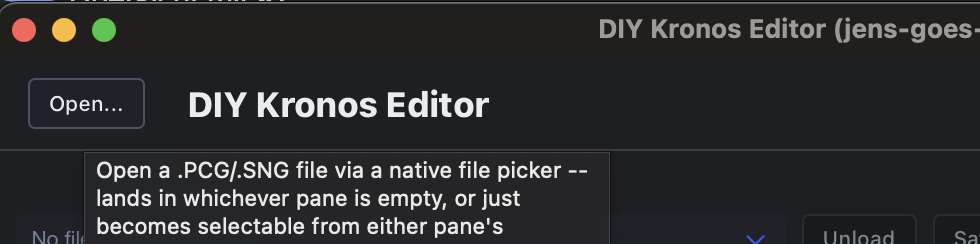
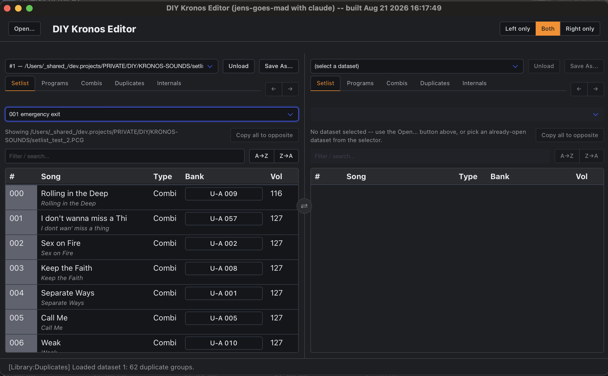
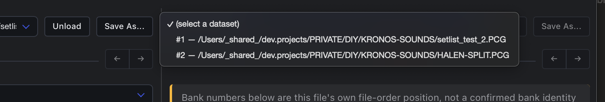
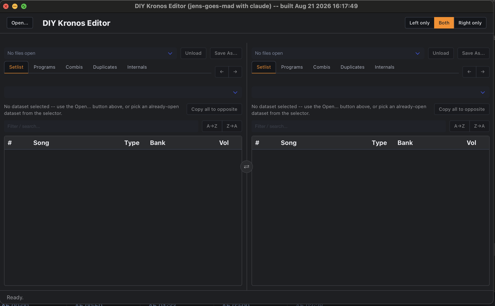
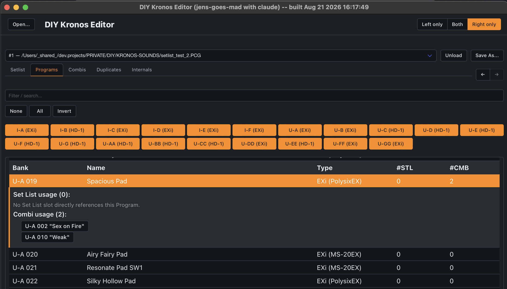

This page is about *using* the app -- what every button does, and how the pieces fit
together for real editing sessions. It covers what's common to the whole app: opening a
file, the dual-pane layout, how browsing and jumping between panes works, and saving.
Each of the three main working areas has its own page, once you've got the basics here:

<!--more-->

- **[Setlist](/guide/setlist)** -- browsing/filtering/sorting a Set List, drag-and-drop
  reordering and copying, editing a slot's Name/Color/Volume/Comment.
- **[Combi](/guide/combi)** -- browsing Combis and their Timbre references, drag-and-drop
  rearranging, copying a Combi across two different backups.
- **[Programs](/guide/prog)** -- browsing Programs, swapping/copying them, finding and
  resolving byte-identical duplicates, resetting a slot back to its factory Init state.

For how the file format itself works, see [The file format](/format); for how the app is
built internally, see [App architecture & components](/components).

## Key features at a glance

- **Open one or more datasets** (`.PCG`/`.SNG` backups) at once -- each stays independently
  loaded in memory until you close it.
- **One or two datasets shown side by side**, in a Norton-Commander-style dual pane -- the
  same dataset from two angles, two different Set Lists of one dataset, or two entirely
  different backups for comparison.
- **[Setlist](/guide/setlist)**: browse/filter all 128 Set Lists; A→Z/Z→A physical re-sort;
  drag-and-drop to reorder or copy a slot (cross-pane, same dataset); edit Name/Color/
  Volume/Comment/Font size inline; copy a whole Set List onto the opposite pane's.
- **[Programs](/guide/prog)**: browse/filter every Program bank; drag one Program onto an empty
  slot to copy it -- same dataset *or* a different one; Shift+drag onto any other
  (already-used) Program to **swap** the two in place; right-click a row to **reset** it
  back to its bank's factory Init Program.
- **[Combi](/guide/combi)**: browse/filter every Combi bank, with each Timbre's own Program
  reference shown as a jump button; drag-and-drop to swap, move within/between banks, or
  copy onto an empty slot -- copying also works *across datasets*.
- **[Duplicates](/guide/prog#duplicates)**: finds byte-for-byte identical Programs and resolves a
  group in one click, repointing every reference that pointed at a cleared copy.
- **Cross-links everywhere**: click any bank/number reference to jump straight to it (see
  [Jumping between panes](#jumping-to-a-program-combi-or-set-list-slot) below).
- **Internals**: a read-only view of exactly which chunks/banks a loaded backup actually
  contains, for backups saved with only a subset of data.
- **Save As** writes a pane's in-memory dataset (including every edit made this session)
  to a file via a native Save dialog.

## Opening a file

Click **Open...** in the topbar. This shows a native file picker (not a browser upload --
the app reads straight off disk) for a `.PCG`/`.SNG` Korg Kronos backup. 

Once loaded, the
file becomes an open **dataset** and lands in whichever of the two panes is empty; if both
already show something, it's still available from either pane's dataset selector.

Opening the same file path twice reuses the already-open dataset instead of loading a
second copy -- both panes end up looking at the exact same in-memory data, so an edit made
in one pane is visible in the other immediately.

## The dual-pane layout

The editor is a Norton-Commander-style dual pane. Each pane, independently:

- Picks which already-open dataset to show, from its own selector (top-left).
- Switches between five categories via its own tab bar: **Setlist**, **Programs**,
  **Combis**, **Duplicates**, **Internals**.

This means two panes can show the same dataset from two different angles (e.g. Setlist on
the left, Duplicates on the right), two different Set Lists of the *same* dataset side by
side, or two entirely different backup files for comparison -- whatever's useful for the
task at hand.

A small **⇄** button floats between the two panes and swaps which side each one is shown
on. This is a pure display swap -- nothing about either pane's own data changes, it just
flips left and right.

### Showing only one pane

The **Left only / Both / Right only** buttons in the top-right corner of the window hide
the other pane and expand the remaining one to full width -- useful on a small screen where
two half-width panes side by side feel cramped. This always means "whichever pane is
currently on that side," not a fixed pane -- if you've swapped panes with **⇄** first,
"Left only" still shows whatever is visually on the left afterward. Nothing about either
pane's data changes; it's a display toggle only, same as the swap button.

## Browsing Programs and Combis

The **[Programs](/guide/prog)**, **[Combi](/guide/combi)**, and **Duplicates** tabs share a few
mechanics, described once here rather than on each page separately:

- **Filter by bank** using the bank-button row above the table (a None/All/Invert row
  bulk-toggles the filter instead of clicking every bank individually).
- Expand a Program or Combi row to see which Set List slots reference it (and, for a
  Program, which Combis too).
- Drag one Program or Combi row onto another to copy/swap/move it -- see the
  [Programs](/guide/prog) and [Combi](/guide/combi) pages for the exact gestures, since they differ
  between the two.

## Jumping to a Program, Combi, or Set List slot

Several places in the app cross-link to each other -- click a bank/number reference and the
same pane switches to the right category, expands that exact row, and scrolls it into view:

- A Setlist slot's **Bank** cell jumps to that exact Program or Combi.
- A Combi's expanded Timbre list shows each Timbre's own Program reference as a button (when
  that Timbre's raw bank code is one of the confirmed ones -- see
  [The file format](/format) for what "confirmed" means here) -- click it to jump straight
  to that Program.
- A Program's expanded usage row lists every Set List slot and every Combi that reference
  it, each as its own button -- click a Set List entry to jump to that exact slot (selecting
  its Set List first if needed), or a Combi entry to jump to that Combi.
- A Combi's own "Set Lists" column (in the Combis table) shows a pill per Set List that
  references it -- click a pill to jump to that slot, same as above.

A normal click always stays within the pane you clicked in. **Shift+click any jump button**
to show it in the *opposite* pane instead, leaving this pane exactly where it was -- handy
for inspecting a cross-reference (e.g. a Combi's Timbre Program) side by side with whatever
you're already looking at. If the opposite pane isn't currently showing the same dataset (a
different one, or none at all), Shift+click switches it to this pane's dataset first, then
jumps.

**Shift+Cmd+click** is a variant of the same idea: it jumps to the *opposite* pane too, but
never switches its dataset -- it jumps to the same bank/number in whatever the opposite pane
already has open. Useful when a foreign/donated file's Combi only references generic/default
sounds, so there's nothing distinctive to identify -- with your own reference backup already
open in the opposite pane, Shift+Cmd+click shows you what's actually stored at that exact same
coordinate on your own unit. If the opposite pane has no dataset open at all, there's nothing
to jump to and a toast says so.

### Back and Forward

Each pane keeps its own history of the last 10 jumps (any of the kinds above), with **←**/
**→** buttons next to that pane's category tabs. Back returns you to the exact row you
jumped *from*, not just its category -- e.g. jumping from a Setlist slot to a Program and
clicking Back lands you back on that same Setlist slot, scrolled into view, not just the
Setlist tab in general. A fresh jump made after going Back discards whatever was ahead in
the history, the same way a browser's forward button works.

## Internals

A read-only diagnostics view: which top-level chunks and which Program/Combi banks the
currently-loaded dataset actually contains. This exists because a real backup can
apparently be saved with only a subset of data included, with nothing else in the app able
to tell you so -- if a bank you expect is missing here, that's why a Program/Combi you're
looking for isn't showing up anywhere in [Programs](/guide/prog) or [Combi](/guide/combi) either.

## Saving your changes

Every edit anywhere in the app -- [Setlist](/guide/setlist) sorts/drags/edits, [Program](/guide/prog)
copies/swaps/resets, [Combi](/guide/combi) swaps/moves/copies including cross-dataset copy,
resolving a duplicate -- writes straight into the dataset's own in-memory copy of the
file's bytes. **Nothing is written to disk until you explicitly save.**

Click **Save As...** next to a pane's dataset selector to write that pane's dataset to a
file via a native Save dialog, pre-filled with its original filename. There's no
autosave yet, so if you close the app without saving, whatever you did in that session
is gone.

**Unload** (next to Save As...) frees a dataset from memory entirely -- if it has any
unsaved changes, a confirmation dialog warns you first, so an accidental click can't
silently lose them. This is the one place unsaved changes are tracked and warned about
right now: closing the whole app, or loading a different file into a pane that's already
showing a dataset with unsaved changes, still discards them without asking. Save
deliberately, and often, if you're doing a long editing session.

This is also the way to test a real reorder on actual hardware: click A→Z (or Z→A, or
build a custom order by hand with drag-and-drop, see [Setlist](/guide/setlist)), Save As to a new
file, then load that file onto a Kronos and scroll through the Set List to confirm it plays
back in the order you built.

## Where to go next

- **[Setlist](/guide/setlist)** -- filtering, sorting, drag-and-drop, editing a slot.
- **[Combi](/guide/combi)** -- browsing, rearranging, cross-dataset copy.
- **[Programs](/guide/prog)** -- browsing, swapping, duplicates, resetting a slot.
