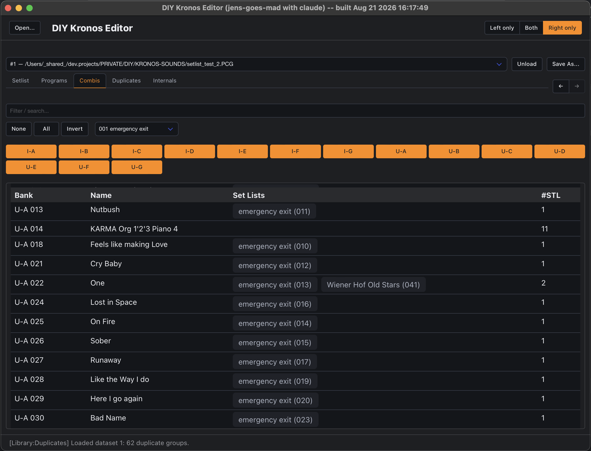
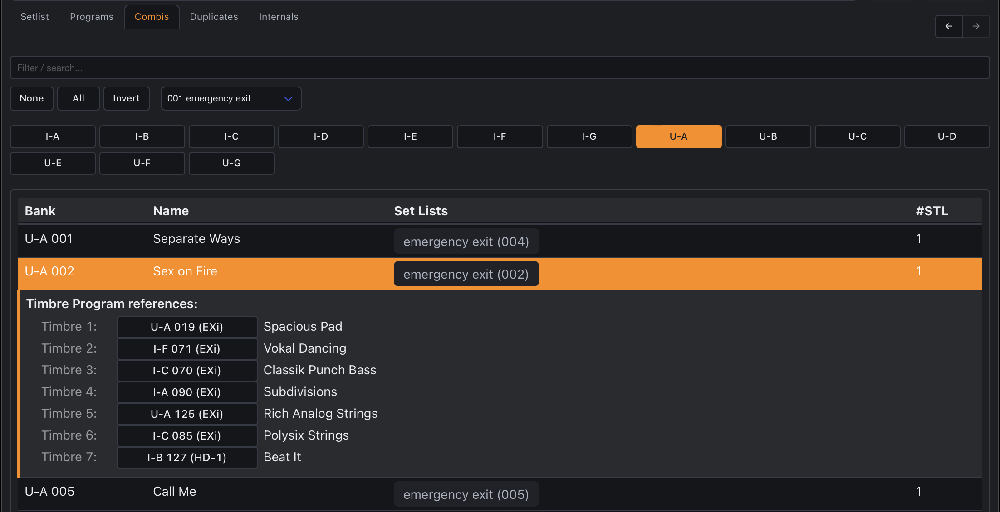

Browsing Combis and their Timbre references, drag-and-drop rearranging, and copying a
Combi to a different backup.

<!--more-->

Part of the [User Guide](/guide) -- see there first for opening a file, the dual-pane
layout, [jumping between panes](/guide#jumping-to-a-program-combi-or-set-list-slot), and
[browsing basics](/guide#browsing-programs-and-combis) (filter by bank, expanding a row).
This page covers what's specific to the Combi tab.

Expanding a Combi row shows all 16 Timbre slots, each with its own referenced [Program](/guide/prog)
(when assigned) as a jump button, and its on/off/engine-type status.

## Rearranging Combis by drag-and-drop

Combi rows are draggable, same as [Setlist](/guide/setlist) slots -- but a Combi is only
ever referenced by Set List slots (never by anything else, unlike a Program, which a
Combi's own Timbres can also reference), so every one of these writes immediately,
repoints every affected Set List reference, and never touches anything else in the file:

- **Drop it directly onto an empty slot** (one still named "Init Combi," Korg's own default
  -- shown in the Name column) to **copy** it there. The source is left completely
  untouched -- this is how you keep two variations of the same Combi, e.g. one tuned for a
  band with a brass section and one without, without ever editing the original. (This used
  to be a Shift-to-copy gesture; Shift/Option don't reliably register during a drag on this
  platform, confirmed directly, so it's unconditional now -- see below for how to *move*
  instead.)
- **Drop it directly onto any other (already-used) Combi** to **swap** the two -- both
  keep their content, just at each other's position, and every Set List slot referencing
  either one follows it to its new spot. Works across banks too, since nothing is destroyed.
  **To move a Combi INTO an empty slot** (rather than copying it there), drag the *empty*
  slot onto the used one instead of the other way around -- it's the same swap gesture,
  just reversed: the used Combi lands where the empty one was, and an "Init Combi" is left
  behind at its old spot.
- **Drop it between two rows in the same bank** (or before the first / after the last) to
  **move** it there, shifting the intervening Combis down one to make room -- same insert
  behavior as a Setlist slot.
- **Drop it between two rows in a different bank** to move it there, **overwriting**
  whatever Combi currently occupies that exact slot. This is refused if the slot being
  overwritten is still referenced by any Set List -- move or copy it elsewhere first. The
  vacated source slot is refilled with a real "Init Combi" record from its own bank (renamed
  `- Init Combi -` so a cleared slot is unmistakable, same visibility idea as
  [Duplicates](/guide/prog#duplicates)' `- Init Program (HD1) -`), so this only works if the
  source's own bank has at least one spare "Init Combi" slot to draw from.

Every one of these shows a toast reporting how many Set List slots got repointed. All of
these gestures are same-dataset only -- for copying across two different files, see below.
As you drag, the target row is **blue** when the drop will *move* or *swap* and **green**
(with a **"+"** cursor) when it will *copy*; an edge line means *insert between rows*.

## Copying a Combi to a different dataset

Dragging a Combi onto an empty slot works across datasets too, not just within one file --
drop it onto an "Init Combi" slot in the *other* pane's dataset to copy it there. Unlike a
same-dataset copy, this has real work to do first: each of the Combi's Timbres references a
specific Program, and that Program has to actually exist in the destination file for the
copy to mean anything.

- If every Program the Combi's Timbres depend on **already exists byte-for-byte identical**
  in the destination, the copy applies immediately -- no extra step, same as any other
  drag-and-drop write in this app.
- If **any Program doesn't exist yet**, a panel slides in from whichever side of the screen
  the drop landed on, listing every Timbre (the ones already resolved grayed out) and, for
  each Program that's missing, a small table -- one row per destination bank of the matching
  engine type that has room, each with its own dropdown of that bank's actual free ("empty")
  Program slots to choose from. Pick the exact slot you want it copied into. Apply copies each
  chosen Program into its chosen slot and repoints the new Combi's Timbres to match, all in
  one step; Cancel abandons the whole drop.

The source Combi (and its dataset) is never touched by any of this -- exactly like a
same-dataset copy, only the destination changes.

**Cross-dataset swap and cross-dataset move-to-a-different-bank (overwrite) aren't
supported yet** -- only the copy-onto-an-empty-slot gesture above works across two
different files; the other three rearrange gestures stay same-dataset-only for now.

## Resetting a slot

Click the **⋯** button in a Combi row's own last column (or right-click the row) for a small local
menu with one action: **Reset entry** (the same
menu the [Programs](/guide/prog#resetting-a-slot) table uses). Confirming it clears the
slot back to a blank "- Init Combi -" -- unlike a Program, there's no single factory
template to write (real "Init Combi" bytes differ across banks), so the blank record is
sourced live from another genuinely blank slot elsewhere in the *same* bank; if that bank
happens to be completely full (no spare "Init Combi" left anywhere in it), the reset is
refused rather than fabricating one. This is a single-slot reset: nothing else in the file
is repointed -- any Set List slot that already referenced this exact slot keeps pointing at
it, and will now show the reset content instead.

This applies immediately once confirmed -- no undo, same as every other write in this app.

## Duplicates

The **[Duplicates](/guide/prog#duplicates)** tab has a **Combi** sub-tab alongside its
Programs one, with the same dropdown picking between the same two checks -- see
[Programs](/guide/prog#duplicates) for the full explanation of each; only the Combi-specific
differences are called out below.

### Same content, different location

Groups Combis that are byte-for-byte identical, one row per group. Expand a group to see
every copy as a plain jump button, and use the group title row's own **⋯** button to open
the same **resolve picker** side panel the Programs version uses -- a **Src** radio (the
copy to keep) plus a **Dupl** checkbox per other copy (choose any subset), a **Resolve**
button once both are set. Resolving repoints every checked Dupl's Set List references to
Src -- **unlike the Programs version, the checked copies' own content is left untouched**:
there's no confirmed "Init Combi" template to reset them to yet, so rather than guess at
one, this only ever repoints references, never clears bytes. Since nothing gets cleared, a
resolved Combi keeps showing up in this same group afterward (it's still byte-identical) --
the picker stays open and simply reflects that, so it's still there to fold in on a later
pass if you want to. The toast reports exactly how many Set List slots were repointed.

### Same name, different content

Combis that share a **name** but are *not* byte-identical, e.g. two Combis both called
"Live Set 1" that turned out to actually be different, or a minor tweak of one that never
got renamed. Expand a group to see each distinct variant as its own visually separated
cluster -- entries within one cluster really are identical to each other; entries in a
different cluster under the same name are not. Every entry is a jump button, same
convention as the Programs sub-tab. Combis have no HD-1/EXi-style engine split, so unlike
the Programs version there's no bank-type label on the group -- a shared name always means
the same kind of thing here.

This check also has the same **⋯** menu on its title row, opening the resolve picker in
**Consolidate** mode -- see [Programs](/guide/prog#same-name-different-content) for the
full explanation. Combis are already the "never clears bytes" case even in the byte-exact
check above, so consolidating different-content Combis behaves exactly the same way as
resolving byte-exact ones: only Set List references move, a checked Dupl's own content
(genuinely different here, unlike the byte-exact case) is always left completely alone.

## See also

- [Programs](/guide/prog) -- what a Timbre reference actually points at, and how Program
  copies/resets/duplicates work.
- [Setlist](/guide/setlist) -- which slots reference a given Combi.
