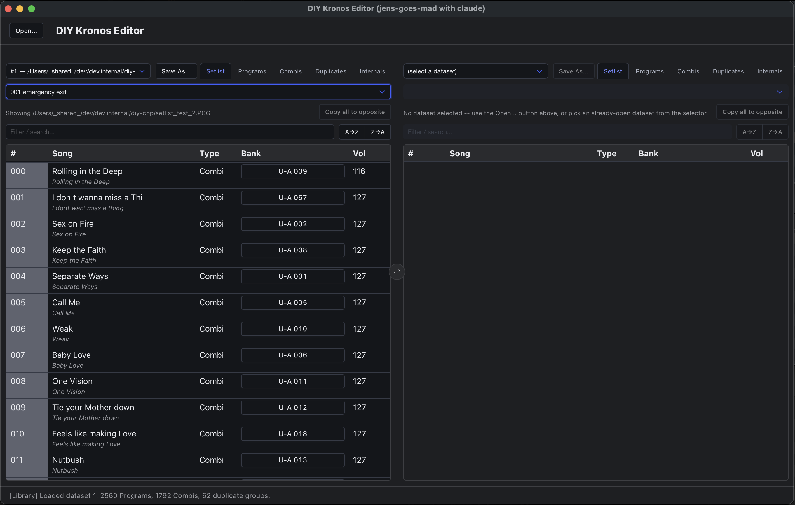
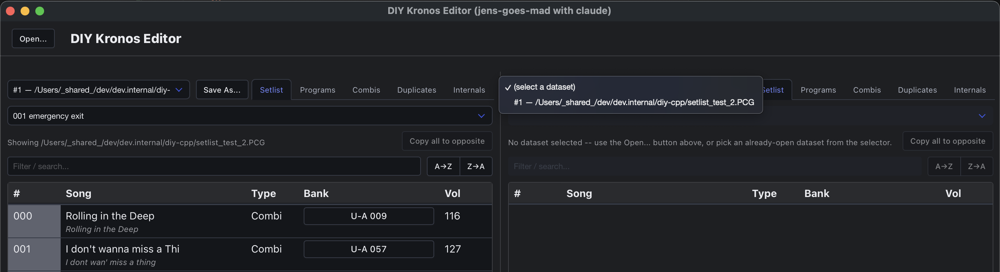
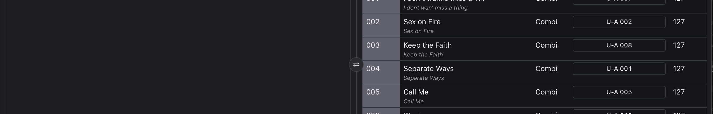
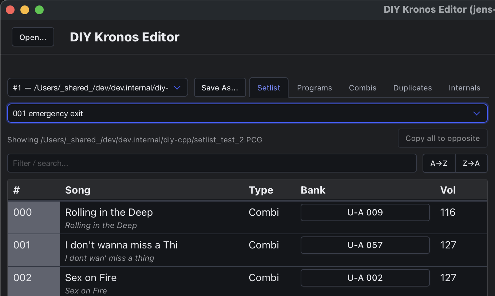
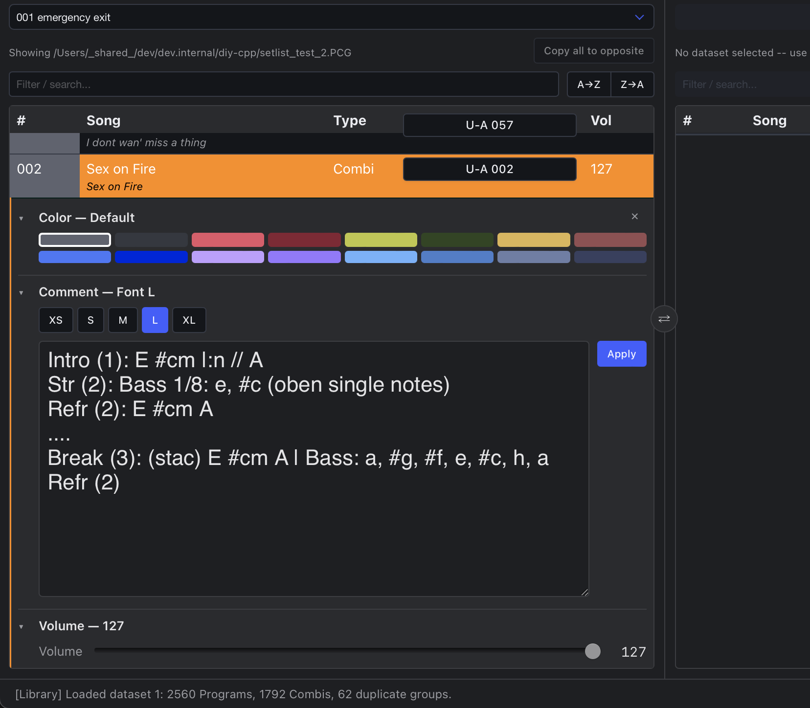

This page is about *using* the app -- what every button does, and how the pieces fit
together for real editing sessions. For how the file format itself works, see
[The file format](/format); for how the app is built internally, see
[App architecture & components](/components).

## Opening a file

Click **Open...** in the topbar. This shows a native file picker (not a browser upload --
the app reads straight off disk) for a `.PCG`/`.SNG` Korg Kronos backup. Once loaded, the
file becomes an open **dataset** and lands in whichever of the two panes is empty; if both
already show something, it's still available from either pane's dataset selector.

Opening the same file path twice reuses the already-open dataset instead of loading a
second copy -- both panes end up looking at the exact same in-memory data, so an edit made
in one pane is visible in the other immediately.

## The dual-pane layout

The editor is a Norton-Commander-style dual pane. Each pane, independently:

- Picks which already-open dataset to show, from its own selector (top-left).
- Switches between five categories via its own tab bar: **Setlist**, **Programs**,
  **Combis**, **Duplicates**, **Internals**.

This means two panes can show the same dataset from two different angles (e.g. Setlist on
the left, Duplicates on the right), two different Set Lists of the *same* dataset side by
side, or two entirely different backup files for comparison -- whatever's useful for the
task at hand.

A small **⇄** button floats between the two panes and swaps which side each one is shown
on. This is a pure display swap -- nothing about either pane's own data changes, it just
flips left and right.

## The Setlist pane

Browse any one of the file's 128 Set Lists, 128 slots each, via the dropdown at the top.

### Filter

The filter box does a live substring search against song names. This is purely a display
convenience -- it only changes which rows are currently *shown*, nothing about the
underlying file.

### Sort (A→Z / Z→A)

These two buttons **physically reorder every one of the Set List's 128 slots** by name --
writing real bytes immediately, exactly like drag-and-drop. This is not a display
convenience: a Korg Kronos has no concept of "sorted" independent of where a slot's data
actually sits in the file (confirmed directly against Korg's own documentation, see
[The file format](/format)) -- it plays back Set List slots strictly in their physical
record position, so the *only* way to make a real unit display things in a different order
is to actually move that data. There's no undo once clicked, same as every other immediate
write in this app.

Sorting always acts on the **whole 128-slot Set List**, regardless of whether the filter
box above is currently narrowing what's shown -- it's not limited to whatever rows happen
to be visible at the time. Empty slots always end up at the bottom regardless of direction,
so they don't get interleaved with the songs you're actually organizing.

### Reordering and copying slots by drag-and-drop

Drag any Setlist row within its own Set List:

- **Drop it directly onto another row** to copy that slot's whole content (name, Program/
  Combi reference, Color, Volume, Comment -- everything) onto the target. The source slot
  is left completely unchanged.
- **Drop it between two rows** (or before the first / after the last) to *insert* it there
  instead -- every slot in between shifts down one to make room. A thin floating line
  follows your cursor while dragging so you can see exactly where the insert will land
  before you let go.

Both of these write real bytes into the loaded file's own in-memory data immediately --
there's no separate "commit" step. Cross-pane dragging (both panes showing the same
dataset) works too, but only within the same dataset -- dragging a slot to a *different*
loaded file is intentionally blocked, since a slot's Program/Combi reference is a raw
bank/number pointer that's only meaningful inside its own file.

### Multi-select

Ctrl/Cmd-click a row to mark it (a green left-edge stripe). This is groundwork for a future
bulk action -- right now it's purely visual bookkeeping and doesn't do anything on its own.

### Copy all to opposite

Once both panes are pointed at the *same dataset* but showing two *different* Set Lists,
the **Copy all to opposite** button (next to the "Showing..." line) becomes active. One
click overwrites every one of the opposite pane's 128 slots with this pane's Set List --
handy for starting a gig's list from an existing prepared one and then only tweaking the
handful of slots that need to change, rather than dragging all 128 by hand. The destination
Set List keeps its own name; only its song slots are replaced.

### Jumping to a Program or Combi

Click a slot's **Bank** cell to jump straight to that exact Program or Combi in the same
pane's Programs/Combis view.

### Editing a slot: General and Comment

Click a slot's **#** or **Vol** cell for **General** (Name, Color, Volume), or its Song/Type
cell for **Comment** (and Font size). Each opens its own collapsible section below the row --
both can be open on the same slot at once.

- **Name, Color, and Volume all apply immediately** -- no Apply button, no confirmation.
  Color applies the moment you click a swatch, Volume the moment you release the slider,
  and Name the moment you leave the field (click elsewhere, Tab away, or press Enter).
  The name field caps at 24 characters (the format's own real limit), enforced as you type.
- **Comment and Font size use an Apply button** -- type/pick, then click Apply to commit.
  The Comment box scales its own on-screen font to match whichever Font size is selected,
  as a live approximation of how the text will actually wrap on a real Kronos screen.
  Comments cap at 512 characters, matching the hardware's own limit.

If both panes are showing the same slot of the same Set List, only one of them can have an
editor open on it at a time -- the second attempt is blocked with a popup explaining why,
rather than risking one pane's edit silently overwriting the other's.

## Programs, Combis, Duplicates, Internals

These three tabs browse every Program and Combi actually stored on the unit, independent of
which Set List slots reference them.

- **Filter by bank** using the bank-button row above the table (a None/All/Invert row
  bulk-toggles the filter instead of clicking every bank individually).
- Expand a Program or Combi row to see which Set List slots reference it.
- **Duplicates** finds Programs that are byte-for-byte identical to each other (a real hash
  of the raw record, not just a name match).
- Drag one Program row onto another (same pane or a different pane's dataset) to copy its
  raw bytes into that slot -- unlike Setlist slots, this works *across* datasets too, since
  a Program's own bank/number isn't referenced by anything outside its own file the way a
  Setlist slot is.

### Programs

TBD

### Combi

### Duplicates

TBD

### Internals

A read-only diagnostics view: which top-level chunks and which Program/Combi banks the
currently-loaded dataset actually contains. This exists because a real backup can
apparently be saved with only a subset of data included, with nothing else in the app able
to tell you so -- if a bank you expect is missing here, that's why a Program/Combi you're
looking for isn't showing up anywhere else either.

## Saving your changes

Every edit above (Sort, drag-and-drop reorders/copies, Color/Volume/Comment, Program
copies) writes straight into the dataset's own in-memory copy of the file's bytes.
**Nothing is written to disk until you explicitly save.**

Click **Save As...** next to a pane's dataset selector to write that pane's dataset to a
file via a native Save dialog, pre-filled with its original filename. There's no
autosave and no "unsaved changes" indicator yet, so if you close the app (or load a
different file into that pane) without saving, whatever you did in that session is gone.

This is also the way to test a real reorder on actual hardware: click A→Z (or Z→A, or
build a custom order by hand with drag-and-drop), Save As to a new file, then load that
file onto a Kronos and scroll through the Set List to confirm it plays back in the order
you built.

## Current limitations

- Copying a Setlist slot **between two different Set Lists** (rather than within one, or
  the whole-list "Copy all to opposite") still uses an older, in-memory-only path -- it
  isn't yet part of what Save As writes out. Same-Set-List reorders/copies and Program
  copies are fully save-durable.
- Multi-select (Ctrl/Cmd-click) doesn't have a bulk action wired up to it yet.
- There's no way yet to delete a duplicate Program and repoint the Combis that referenced
  it at the single kept copy -- Duplicates can find them, but cleanup is still manual.
- No dirty-tracking or autosave, as above -- save deliberately, and often, if you're doing
  a long editing session.
