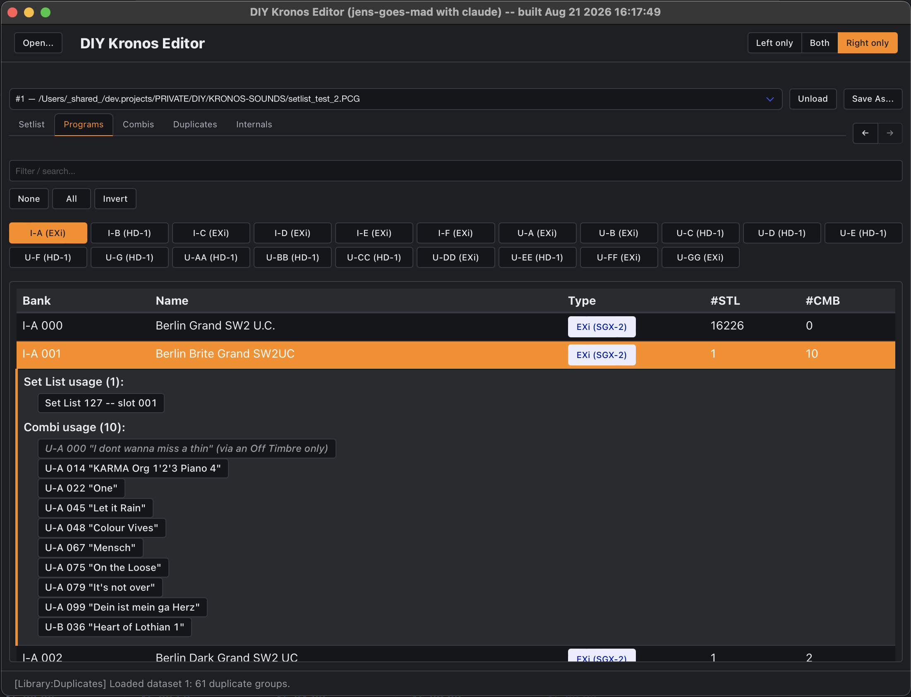

Browsing Programs, swapping/copying them, finding and resolving byte-identical
duplicates, and resetting a slot back to its factory Init state.

<!--more-->

Part of the [User Guide](/guide) -- see there first for opening a file, the dual-pane
layout, [jumping between panes](/guide#jumping-to-a-program-combi-or-set-list-slot), and
[browsing basics](/guide#browsing-programs-and-combis) (filter by bank, expanding a row).
This page covers what's specific to the Programs tab, including Duplicates.

Expanding a Program row shows two lists: every **Set List slot** that references it, and
(where confirmed -- see [The file format](/format) for which banks that covers) every
**Combi** that references it through one of its Timbres. Each entry is its own jump button
(see the [User Guide](/guide)'s Jumping section), so you can go straight from a Program to
everywhere it's actually used.

## Copying a Program by drag-and-drop

Drag one Program row onto an empty slot (same pane or a different pane's dataset) to copy
its raw bytes into that slot -- unlike a [Setlist](/guide/setlist) slot, this works *across*
datasets too, since a Program's own bank/number isn't referenced by anything outside its
own file the way a Setlist slot is. The only thing that blocks a copy is the destination
already holding a *different* real Program (drop onto that to [swap](#swapping-programs-by-shiftdrag)
instead) -- copying a Program that's already byte-identical to another one elsewhere in the
file is completely fine and creates a real, independent third copy; there's no restriction
against duplicate content.

**Copying a Program this way copies its entire raw record verbatim, including its KARMA
settings** -- and whether every part of those settings is safe to carry over between two
different banks or two different files hasn't been investigated yet (see
[The file format](/format) §8 #15). If a copied Program's KARMA behavior (Switch/Fader
assignments, Generated Effect module) looks wrong after a copy, this is why -- please
report it with the specific Program/Combi involved if you hit this, it would be real,
valuable ground truth. This applies to copying a Program directly, or as part of a
[Combi](/guide/combi) copy, and to a same-dataset copy just as much as a cross-dataset one.

### Swapping Programs by Shift+drag

A plain drop onto another (already-used) Program never lights up as a valid target in the
first place -- the row simply doesn't turn green and the cursor shows "not allowed," rather
than accepting the drop and failing afterward, same as dropping onto a used
[Setlist](/guide/setlist) slot. **Hold Shift before you start dragging** (and keep it held)
to swap the two instead: both keep their content, just at each other's position, and every
Set List slot and every Combi Timbre that referenced either one follows it to its new spot.
Same dataset only (a swap has no meaning across two different files). It's the only way to
exchange two occupied slots' positions without losing either one's content -- a plain copy
always refuses to overwrite a slot that already holds a different Program.

**This gesture is unverified and may not register reliably** -- the equivalent Shift-drag
gesture on the Combi table turned out not to register at all (confirmed directly, tried
before *and* during the drag, and with Option/Alt too), which is why Combi dropped Shift
entirely in favor of an unconditional gesture. Programs' version hasn't been re-tested the
same way yet; if it doesn't work for you either, say so.

While you drag, the target row is **green** with a **"+"** cursor when the drop will
*copy* and **blue** when Shift is held (and registers) and it will *swap*.

### Reordering Programs by drag-and-drop

Drop a Program row **between two rows** (or before the first / after the last) instead of
directly onto one, and it *moves* there rather than copying or swapping -- the same
before/after insert gesture the [Setlist](/guide/setlist) and [Combi](/guide/combi) tables
already have, with a line along the target row's top/bottom edge showing exactly where it
will land.

- **Within the same bank**, this shifts the intervening Programs down one to make room --
  every Set List slot and Combi Timbre that referenced any of the shifted Programs follows
  its content to its new position, same as a swap.
- **Into a different bank of the SAME engine type** (HD-1 or EXi), this overwrites whatever
  Program currently occupies that exact slot -- refused if the slot being overwritten is
  still referenced by any Set List slot or Combi Timbre (move or copy it elsewhere first).
  The vacated source slot is refilled with that bank's own factory Init Program template
  (the same one [Resetting a slot](#resetting-a-slot) below writes).
- **Into a bank of a DIFFERENT engine type** isn't offered at all -- a Program's own raw
  bytes are engine-specific, same guard the copy/swap gestures above already enforce.

Same-dataset only, like the swap gesture above -- dragging between two different files'
panes only ever copies.

## Resetting a slot

Click the **⋯** button in a Program row's own last column (or right-click the row) for a small
local menu with one action: **Reset entry**. Confirming it writes that bank's factory Init Program (HD-1 or EXi, whichever matches the
slot) straight over it -- the same content a brand-new, never-touched slot has. This is a
single-slot reset: unlike resolving a [duplicate](#duplicates) below, nothing else in the
file is repointed -- any Set List slot or Combi Timbre that already referenced this exact
slot keeps pointing at it, and will now show the reset content instead.

This applies immediately once confirmed -- no undo, same as every other write in this app.

## Duplicates

Two vertical sub-tabs, **Programs** and **[Combi](/guide/combi)** -- library-hygiene checks
for entries that are unexpectedly the same, or unexpectedly different, from each other.
Each sub-tab has its own dropdown picking which of the two checks below is showing; both
checks exist for both Programs and Combis. This page covers the Programs sub-tab; see
[Combi](/guide/combi) for the same two checks applied to Combis instead.

### Same content, different location

Groups Programs that are byte-for-byte identical (a real hash of the raw record, not just a
matching name), one row per group. Expand a group to see every copy as a plain jump button --
same click/Shift+click/Shift+Cmd+click convention as every other cross-reference in this app,
see [Jumping between panes](/guide#jumping-to-a-program-combi-or-set-list-slot). Clicking a
copy never writes anything; resolving is a separate, deliberate step below.

Click the **⋯** button beside a group's own title row (visible whether the group is expanded
or not) to open the **resolve picker**, a side panel listing every copy in that group with two
selectors each: a **Src** radio button (exactly one copy, the one to keep) and a **Dupl**
checkbox (any number of the *other* copies -- disabled for whichever one is currently Src).
Picking a Src automatically checks every other copy as Dupl -- the common case is folding in
everything except the one you're keeping, so that's the one-click default; un-check any
specific copy you want to leave alone instead (e.g. an intentional backup rather than genuine
clutter) -- picking a *different* Src resets the selection back to "everyone else" again. A **Resolve**
button appears once a Src and at least one Dupl are chosen; clicking it clears every checked
Dupl back to a blank slot -- its bank's own factory-default template, HD-1 or EXi depending on
that copy's engine type -- and repoints every Set List slot or Combi Timbre that referenced a
cleared copy to Src instead. A cleared slot's name reads `- Init Program (HD1) -` or
`- Init Program (EXi) -` (deliberately more visible than Korg's own plain `Init Program`/
`Init EXi Program`, so a cleared slot is unmistakable at a glance rather than looking like any
other blank one).

This applies immediately -- no confirmation step, no undo, same as every other write in this
app -- and shows a toast reporting exactly what changed. The picker stays open afterward and
re-lists whatever's left in the group, so folding in a large group a few copies at a time
(or checking your work) doesn't mean reopening it each time.

### Same name, different content

The inverse question: Programs that share a **name** but are *not* byte-identical -- e.g.
two Programs both called "Bass 1" that turned out to actually be two different sounds
somewhere along the way, not real duplicates, or a minor tweak of one that never got
renamed. Expand a group to see each distinct variant as its own visually separated cluster
of entries -- entries within one cluster really are identical to each other; entries in a
different cluster under the same name are not. An HD-1 Program and an EXi Program never
share a group here even if they happen to have the same name -- two entirely different
synth engines is coincidence, not a real "these are probably the same sound" signal, so
groups are labeled with their engine (e.g. "Bass 1 (HD-1)") once there's more than one.

Every entry is a jump button (same click/Shift+click/Shift+Cmd+click convention as above),
and the group's own title row has the same **⋯** menu the byte-exact check does, opening the
same resolve-picker sidebar -- **Consolidate**, not Resolve, since these entries genuinely
differ. Pick a **Src** and check one or more **Dupl** entries the same way, from *any* of
the group's variant clusters (not just within one) -- consolidating a real, deliberate
"this was just a minor edit of that" case is exactly the point. The key difference from the
byte-exact picker: consolidating here **never clears anything**. A checked Dupl's own
content stays exactly as it is -- only its Set List/Combi Timbre references move to Src --
because that content is genuinely different and destroying it can't be undone. Since
nothing about a variant's content changes, the group doesn't shrink the way a byte-exact
one does -- the same entries are still there for a later pass if you want to consolidate
more later.

Placeholder-named slots (`Init Program`, empty slots) are excluded from this check entirely,
since every untouched slot would otherwise show up as one giant, meaningless "collision."

Resolving a duplicate can only repoint a Combi Timbre reference to/from a Program bank
whose raw Timbre bank code is independently confirmed (see [The file format](/format)) --
in practice this covers every real bank on a real backup, but if a reference can't be
safely repointed the toast says so explicitly rather than silently skipping it.

## See also

- [Combi](/guide/combi) -- Timbres reference a Program by exactly this bank/number.
- [Setlist](/guide/setlist) -- a slot's **Bank** cell jumps straight to a Program.
