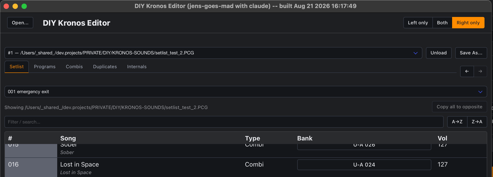
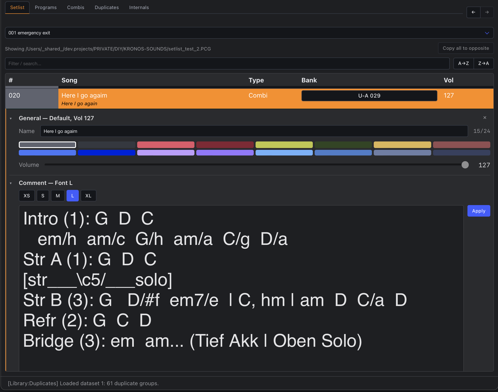

Browsing, filtering, sorting, drag-and-drop reordering and copying, and editing a
Setlist slot's Name/Color/Volume/Comment.

<!--more-->

Part of the [User Guide](/guide) -- see there first for opening a file, the dual-pane
layout, [jumping between panes](/guide#jumping-to-a-program-combi-or-set-list-slot), and
saving. This page covers the Setlist tab itself.

Browse any one of the file's 128 Set Lists, 128 slots each, via the dropdown at the top.

## Filter

The filter box does a live substring search against song names. This is purely a display
convenience -- it only changes which rows are currently *shown*, nothing about the
underlying file.

## Sort (A→Z / Z→A)

These two buttons **physically reorder every one of the Set List's 128 slots** by name --
writing real bytes immediately, exactly like drag-and-drop. This is not a display
convenience: a Korg Kronos has no concept of "sorted" independent of where a slot's data
actually sits in the file (confirmed directly against Korg's own documentation, see
[The file format](/format)) -- it plays back Set List slots strictly in their physical
record position, so the *only* way to make a real unit display things in a different order
is to actually move that data. There's no undo once clicked, same as every other immediate
write in this app.

Sorting always acts on the **whole 128-slot Set List**, regardless of whether the filter
box above is currently narrowing what's shown -- it's not limited to whatever rows happen
to be visible at the time. Empty slots always end up at the bottom regardless of direction,
so they don't get interleaved with the songs you're actually organizing.

## Reordering and copying slots by drag-and-drop

Drag any Setlist row within its own Set List, or onto the same Set List shown in the
*opposite* pane:

- **Drop it directly onto an empty slot** to copy that slot's whole content (name, Program/
  Combi reference, Color, Volume, Comment -- everything) onto the target. The source slot
  is left completely unchanged. This works between two *different* Set Lists too (same
  dataset), not just within one. **Dropping onto a slot that's already in use refuses** --
  same reasoning the [Programs](/guide/prog) and [Combi](/guide/combi) tables already
  enforce for their own onto-occupied copy: a copy-over is silent and total, so landing on
  a used slot by accident would destroy it with no undo anywhere in this app. [Reset the
  slot](#resetting-a-slot) first to make it a valid target again, or drop onto a genuinely
  empty one.
- **Drop it between two rows** (or before the first / after the last) to *insert* it there
  instead -- every slot in between shifts down one to make room. A line appears along the
  top or bottom edge of the row you're hovering to show exactly where the insert will
  land. Unlike copy-over above, insert only works **within the same Set
  List** -- inserting into a *different*, already-full 128-slot Set List would have to
  evict something at its far end to make room, a real data-loss question not tackled yet,
  so that specific case still uses an older, in-memory-only path that isn't part of what
  Save As writes out.

While you drag, the feedback tells you what a drop right now would do: a **green** row
with a **"+"** cursor means it will *copy* (the only thing an onto-a-row drop ever does
here), the edge line means *insert*, and hovering a slot that's already in use shows
neither -- the cursor itself goes to "not allowed." Same green-for-copy/edge-line-for-
insert visual language the Programs and Combis tables use, plus a **blue** row there for
their own *swap* gesture, which Setlist doesn't have.

Both of these write real bytes into the loaded file's own in-memory data immediately --
there's no separate "commit" step, for every case except the cross-Set-List insert noted
above. Dragging a slot to a *different loaded file* (a different dataset entirely) is
intentionally blocked, since a slot's Program/Combi reference is a raw bank/number pointer
that's only meaningful inside its own file.

## Resetting a slot

Click the **⋯** button in a slot's own last column (or right-click the row) for a small
local menu with one action: **Reset entry** (the same menu the [Programs](/guide/prog#resetting-a-slot)
and [Combi](/guide/combi#resetting-a-slot) tables use). Confirming it clears the slot back
to a blank **"- Init Setlist -"** -- no Program/Combi reference, and Color/Volume/Font
size/Transpose/Comment all back to their defaults. Unlike a Program or Combi reset, this
needs no factory template or live donor: a genuinely untouched Set List slot's own bytes
are confirmed blank on real hardware, so writing blank bytes back already matches that
exactly -- the visible "- Init Setlist -" name is purely this app's own marker (same
convention as Combi's "- Init Combi -"), so a slot you deliberately cleared reads
differently from one that was simply never touched.

This applies immediately once confirmed -- no undo, same as every other write in this app.

## Multi-select

Ctrl/Cmd-click a row to mark it (a green left-edge stripe). This is groundwork for a future
bulk action -- right now it's purely visual bookkeeping and doesn't do anything on its own.

## Copy all to opposite

Once both panes are pointed at the *same dataset* but showing two *different* Set Lists,
the **Copy all to opposite** button (next to the "Showing..." line) becomes active. One
click overwrites every one of the opposite pane's 128 slots with this pane's Set List --
handy for starting a gig's list from an existing prepared one and then only tweaking the
handful of slots that need to change, rather than dragging all 128 by hand. The destination
Set List keeps its own name; only its song slots are replaced.

## Editing a slot: General and Comment

Click a slot's **#** or **Vol** cell for **General** (Name, Color, Volume), or its Song/Type
cell for **Comment** (and Font size). Each opens its own collapsible section below the row --
both can be open on the same slot at once.

- **Name, Color, and Volume all apply immediately** -- no Apply button, no confirmation.
  Color applies the moment you click a swatch, Volume the moment you release the slider,
  and Name the moment you leave the field (click elsewhere, Tab away, or press Enter).
  The name field caps at 24 characters (the format's own real limit), enforced as you type.
- **Comment and Font size use an Apply button** -- type/pick, then click Apply to commit.
  The Comment box scales its own on-screen font to match whichever Font size is selected,
  as a live approximation of how the text will actually wrap on a real Kronos screen.
  Comments cap at 512 characters, matching the hardware's own limit.

If both panes are showing the same slot of the same Set List, only one of them can have an
editor open on it at a time -- the second attempt is blocked with a popup explaining why,
rather than risking one pane's edit silently overwriting the other's.

## See also

- A slot's **Bank** cell jumps straight to the [Program](/guide/prog) or [Combi](/guide/combi) it
  references -- see the [User Guide](/guide)'s Jumping section for the full set of
  cross-link gestures (Shift+click, Shift+Cmd+click, Back/Forward).
- [Saving your changes](/guide#saving-your-changes) covers what's and isn't written to
  disk immediately.
