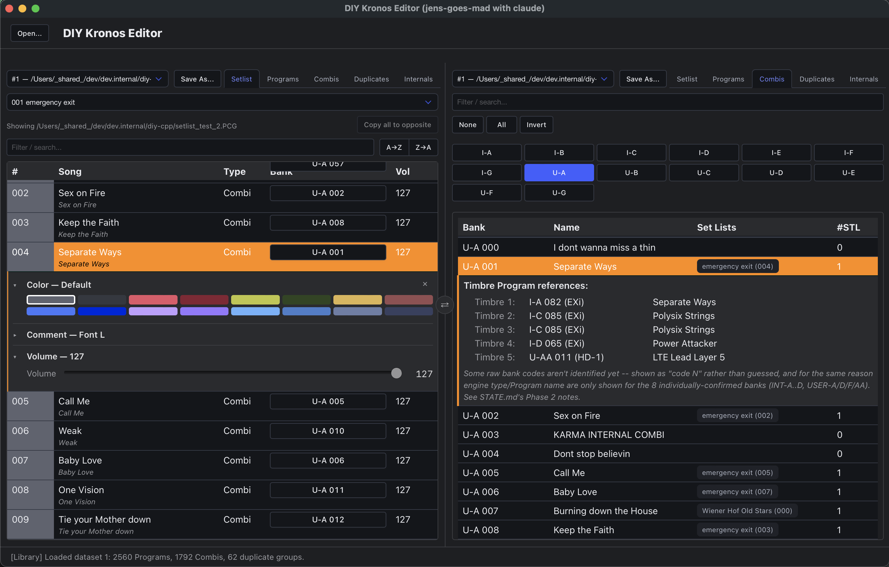

# DIY Kronos Editor

Welcome to the build log for a from-scratch reverse-engineering of the Korg Kronos `.PCG`/`.SNG` backup file format, and a cross-platform, cross-architecture editor built on top of what's been found. Korg never published a spec for the container/chunk format the `.PCG`/`.SNG` file itself is built from -- that part is entirely reverse-engineered here -- but Korg's own SysEx documentation does describe the bit-level layout of individual objects (Set Lists, Programs, Combis), and gets used as a real, independent cross-check wherever it exists. Every byte offset documented here was derived the same way, over and over: get a real backup file with known ground truth (a Set List with real song names, a Combi with known Timbre assignments, ...), diff it against what's expected, and only trust what round-trips correctly against at least one independent anchor -- Korg's own documentation being one of them where available, not a replacement for verifying against real files.

## What a Kronos backup actually holds

A Korg Kronos is a music workstation -- part synthesizer, part sampler, part sequencer --
and its `.PCG`/`.SNG` backup is a full snapshot of everything stored on the unit:

- **Programs** -- single sounds (patches), organized into banks (INT-A..G, USER-A..G,
  and more), up to 128 per bank.
- **Combis** -- up to 16 Programs layered/split/velocity-switched together across
  "Timbres," organized into their own set of banks.
- **Set Lists** -- 128 performance-oriented playlists, each with 128 slots, every slot
  pointing at either a Program or a Combi by bank/number, plus a hold time, volume,
  color, and a free-text comment -- what a keyboard player actually scrolls through
  live on stage.

None of this is documented by Korg beyond the user manual's *behavior*. The on-disk
*layout* -- which bytes mean what -- is entirely reverse-engineered here.

## What's confirmed so far

- **Container format**: chunked, RIFF/IFF-like but big-endian -- every chunk has a
  fixed 12-byte header, `[4-char tag][u32 size][4-byte unknown field "dwX"]`, followed
  by exactly `size` bytes of content (a nested chunk's own size is counted in full
  toward its parent's, all the way down). `PCG1` itself is a real top-level chunk
  spanning the rest of the file, not implicit padding before the "real" content
  starts. Top-level children of interest: `SLS1` (Set Lists), `PRG1` (Programs, 20
  sub-banks), `CMB1` (Combis, 14 sub-banks) -- `DKT1`/`WSQ1`/`GLB1`/`DPI1` (Drum Kits,
  Wave Sequences, Global settings, and one unidentified chunk) exist but are unexplored.
- **Set Lists** (`SDB1`): all 128 Set Lists, 128 song slots each, extracted correctly --
  verified against real user-named lists and real song titles given directly as ground
  truth, not guessed.
- **Per-slot parameters** (`SBK1`): Program-vs-Combi flag, bank, number, color, hold
  time, volume, Font size, Transpose, and a free-text comment, all at confirmed fixed
  offsets within a 542-byte-stride record -- Font size and Transpose are each a few bits
  packed into bytes otherwise used by Color/Bank, confirmed via a purpose-built test file
  that isolated each field one at a time.
- **Instrument name cross-reference** (`CBK1`/`MBK1`/`PBK1`): every Set List slot's real
  Program/Combi name, resolved and shown inline -- confirmed against three independent
  named anchors.
- **Combi Timbre-to-Program references**: each Combi's 16 Timbres sit at a fixed
  188-byte stride starting 4806 bytes into the Combi's own record: byte 0 is the
  referenced Program's number, byte 1 a raw bank code, byte 2 an on/off/engine-type
  status (Internal/External/Ex2/Off). Confirmed bank codes so far: `INT-A`=0, `INT-B`=1,
  `INT-C`=2, `INT-D`=3, `USER-A`=17, `USER-D`=20, `USER-F`=22, `USER-AA`=24 -- enough to
  see the shape of an absolute, gapped numbering scheme (not simple file order), though
  not every bank is mapped yet. Independently cross-checked against a third-party
  reverse-engineering of this same format,
  [DaBlick/PCG-Tools](https://github.com/DaBlick/PCG-Tools) -- both sources agree at
  every point they overlap, and it resolved what first looked like a gap in this
  project's own model (turned out to be a Combi sample whose remembered state didn't
  match what was actually saved in the file, not a parsing error).

Deliberately **not** solved yet: a handful of reserved bytes whose purpose isn't known
(byte +17 still has unexplained bits even after Font size/Transpose were found), Drum
Kits/Wave Sequences/Global settings, and exactly which of the 20 Program banks
corresponds to which on-screen label beyond the ones directly confirmed above.

## The editor

- A Norton-Commander-style dual pane: each pane independently picks which already-open
  **dataset** (loaded file) to show from its own selector, and a per-pane category
  navbar (Setlist / Programs / Combis / Duplicates / Internals) switches what that pane
  is browsing -- so two panes can show different categories of the same dataset, the same
  category of two different datasets side by side, or anything in between. A swap button
  between the two panes flips which side each one is shown on -- a pure display swap,
  nothing about either pane's own data changes. Point both panes at the same dataset to
  rearrange one backup (edits show up in both immediately) or work on two different Set
  Lists of it side by side; point them at different datasets to compare two backups --
  see [App architecture & components](/components) for how this is built.
- **Setlist**: browse any Set List's 128 slots with filter/search. Drag a row within its
  own Set List to reorder things -- drop it directly onto another slot to copy that
  slot's whole content over the target (name, Program/Combi reference, Color/Volume/
  Comment together; the source slot is left untouched), or drop it between two slots (or
  before the first/after the last) to insert it there instead, shifting every slot in
  between down one to make room -- a floating line shows exactly where the insert will
  land as you drag. A **"Copy all to opposite"** button clones an entire prepared Set
  List onto the other pane's currently-selected one in a single click (both panes need to
  already be on the same dataset with two different Set Lists picked) -- built for
  starting a gig's list from an existing one and then only touching the handful of slots
  that need to change. Ctrl/Cmd-click marks rows for a future bulk action (nothing wired
  up to the selection yet -- groundwork for what's next). Jump straight from a slot's
  Bank/number to that exact Program or Combi in the same pane's Programs/Combis view.
  Click a slot's # for its Color (one of the 16 real Kronos Set List colors), Vol for
  its Volume (0-127), or Song/Type for its Comment and Font size -- one editor panel per
  slot with a collapsible section per field (several can be expanded at once), a single
  Close button to dismiss it, editing straight into the loaded file's own raw bytes
  (Color/Volume apply immediately, Comment+Font size via Apply) -- see
  [App architecture & components](/components) for exactly how a panel attaches,
  writes back, and discards itself. The Comment box itself scales its on-screen font
  size to match whichever Font size is selected, using real per-size character-width
  ratios confirmed against a real Kronos -- a live approximation of how the text will
  actually wrap on the device, not just a label picker. If both panes point at the same Set List of the
  same dataset, opening an editor on a slot already open in the other pane is blocked
  outright (with a popup explaining why) rather than risking one pane's edit silently
  overwriting the other's.
- **Programs / Combis / Duplicates**: browse every Program and Combi on the unit
  directly (not just through Set List slots), filter by bank (a None/All/Invert row
  above the bank buttons bulk-toggles the filter instead of clicking each bank one by
  one), see which Set List slots reference a given Program, and find Programs that are
  byte-for-byte duplicates of each other (down to the raw record hash).
- **Internals**: a read-only diagnostics view of which top-level chunks and which
  Program/Combi banks a dataset actually contains -- built after noticing that a
  backup tool letting you choose what data to save could plausibly omit banks
  entirely, with nothing in the app able to tell you so. Building it surfaced a
  real, previously-unknown gap: every Program/Combi bank "index" this project uses
  anywhere is just that bank's position among however many bank sub-chunks were
  found, in file order, not a confirmed identity tied to any byte in the file --
  see [the file format reference](/format) for the open question this leaves
  unresolved. The pane is deliberately honest about this: it reports how many of
  the expected banks were found without claiming to know *which* bank a shortfall
  corresponds to. Initializing an empty bank/patch is a planned follow-up, waiting
  on real Init-Program byte data from actual Kronos hardware before it's built,
  per this project's no-guessing rule.
- Opens a file via a real native Open dialog (fixed a long-standing macOS z-order bug
  by calling `NSOpenPanel` directly rather than through the WebView's own broken
  delegate) -- opening the same path twice reuses the existing dataset instead of
  loading a second copy.
- Built on [CHOC](https://github.com/Tracktion/choc) (HTML/JS/CSS UI over a thin native
  C++ bridge) -- the same stack as the sibling `DIY-MIDI-METRONOME/EDITOR` project,
  reused rather than reinvented -- with [Bulma](https://bulma.io) (vendored, CSS-only,
  no JS/build-step dependency) for layout and styling on top.
- Genuinely cross-platform: one CMake project builds on macOS (arm64 + Intel), Linux,
  and Windows, verified by CI on all four targets -- see [Building the app](/building).

A `saveFileAs()` bridge method can write a dataset's edited bytes back to a file (no Save
UI yet -- no dialog, no dirty-tracking, currently exercised via a devtools-console
script rather than a button), but actually deleting duplicate Programs and repointing
Combis at a single kept copy is still planned, not built -- it needs the Combi Timbre
reference work above finished first, and real-hardware validation of the write path
(currently in progress, see `STATE.md`) before anything that deletes data is a good
idea to add on top -- not something to bolt on carelessly to someone's real synth
backup.

## Why

The Kronos's own Set List and Combi/Program browsing on the hardware is workable but
slow to search across hundreds of slots, and with no published format, cleaning up years
of accumulated duplicate Programs or reorganizing Set Lists across two backups side by
side meant either doing it entirely by hand on the unit, or not at all.

This project is scratching that itch, one confirmed byte offset at a time, 
for fun, 
thus: [jens-goes-mad](/me).

## Where to look next

- [The file format](/format) -- the full `.PCG`/`.SNG` container/chunk layout,
  SDB1/SBK1/CBK1/MBK1/PBK1 record structures, Combi Timbre references, and a running
  list of open questions.
- [Building the app](/building) -- how to compile it yourself on macOS, Linux, or
  Windows.
- [App architecture & components](/components) -- how the UI is being split into small,
  standalone, byte-level-tested pieces, and why.
- [Project status](https://github.com/jens-goes-mad/DIY-KORG-KRONOS-EDITOR/blob/main/STATE.md) --
  what's built, what's verified, and the full list of known blind spots.

---

More to come as the reverse-engineering and the editor both progress.
