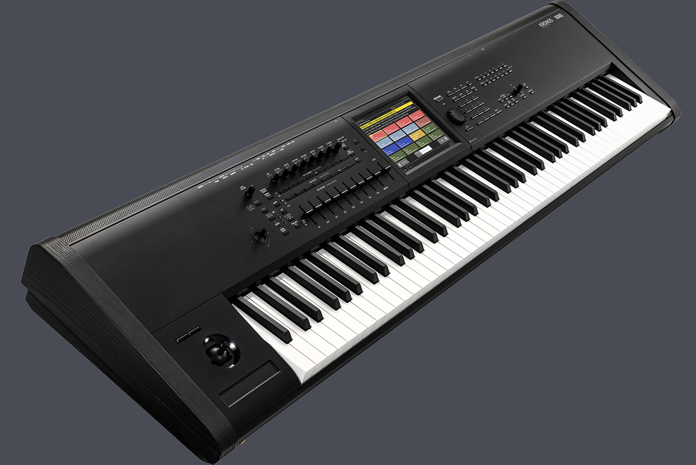

# DIY Kronos Editor

A cross-platform, cross-architecture editor for the Korg Kronos `.PCG`/`.SNG` backup file --
built on top of a from-scratch reverse-engineering of a format Korg has never published a
spec for. This page is the high-level tour: what the project is for, what it can do today,
and why it's built the way it is. For the byte-level technical detail, see
[The file format](/format); for a full feature-by-feature walkthrough of the app, see the
[User Guide](/guide).

*Photo: [Korg](https://www.korg.com/de/products/synthesizers/kronos3/)*

## What a Kronos backup actually holds

A Korg Kronos is a music workstation -- part synthesizer, part sampler, part sequencer --
and its `.PCG`/`.SNG` backup is a full snapshot of everything stored on the unit:

- **Programs** -- single sounds (patches), organized into banks (INT-A..G, USER-A..G,
  and more), up to 128 per bank.
- **Combis** -- up to 16 Programs layered/split/velocity-switched together across
  "Timbres," organized into their own set of banks.
- **Set Lists** -- 128 performance-oriented playlists, each with 128 slots, every slot
  pointing at either a Program or a Combi by bank/number, plus a hold time, volume,
  color, and a free-text comment -- what a keyboard player actually scrolls through
  live on stage.

None of this is documented by Korg beyond the user manual's *behavior*. The on-disk
*layout* -- which bytes mean what -- is entirely reverse-engineered here, one confirmed
byte offset at a time, never a plausible-looking guess left unchecked. See
[The file format](/format) for exactly how, and how much of it is confirmed so far.

## Why this project exists

There's already a Windows tool for this: [PCG Tools](https://www.kronoshaven.com/pcgtools/),
by Michel Keijzers, hosted at Kronoshaven -- a real librarian/list-generator/limited editor
for Kronos (and other Korg workstation) backups. It's a genuinely useful piece of software.
It's also Windows-only, and per Kronoshaven's own hosting page, "chances are Michel won't be
updating the software anymore." This project exists to close that gap: something that
actually runs natively wherever you are, and is being actively worked on.

"Actually runs natively wherever you are" is a real design constraint, not just a wish --
the UI is plain HTML/JS/CSS, hosted inside a thin native C++ shell via
[CHOC](https://github.com/Tracktion/choc), which wraps the *operating system's own* WebView
(WebKit on macOS, WebView2 on Windows, WebKitGTK on Linux) rather than bundling a whole
browser engine the way Electron does. That means the entire UI -- every pane, every editor,
every byte-level codec -- is one shared codebase across macOS (Intel and Apple Silicon),
Linux, and Windows, with only the thin native bridge layer (file I/O, native dialogs) written
per platform. One CMake project, verified by CI on all four targets -- see
[Building the app](/building).

## What's built so far

The file format side: container/chunk parsing, all 128 Set Lists, per-slot parameters
(Program/Combi reference, Color, Volume, Hold Time, Font size, Transpose, Comment), the
Program/Combi instrument-name cross-reference, and Combi Timbre-to-Program references with
all 20 Program banks' raw bank codes now confirmed -- cross-checked against Korg's own SysEx
documentation and an independent third-party reverse-engineering effort where either exists,
never trusted blindly. Full detail, including exactly what's still open, is in
[The file format](/format).

The editor side, briefly (see the [User Guide](/guide) for the real walkthrough):

- A dual-pane, Norton-Commander-style browser -- each pane independently picks a dataset and
  a category (Setlist / Programs / Combis / Duplicates / Internals), so two panes can show
  anything from two different angles of the same file, two different Set Lists side by side,
  or two entirely different backups for comparison. A pane-visibility toggle (Left only /
  Both / Right only) makes this usable on a small screen too.
- Real editing that writes straight into the loaded file's own bytes: Set List slot
  reordering and copying by drag-and-drop, Color/Volume/Comment/Font-size editing, A-Z/Z-A
  physical re-sorting, copying a Program's raw bytes into another slot (same file or a
  different one), and rearranging Combis by drag-and-drop -- swap, move within or between
  banks, or copy onto an empty slot -- with every affected Set List reference repointed
  automatically. Copying a Combi onto an empty slot works *across datasets* too: every
  Program its Timbres depend on is matched byte-for-byte against the destination file, and
  a sliding panel lets you choose where to place any that don't exist there yet before the
  copy applies.
- Cross-links between everywhere a Program/Combi/Set List slot references another --
  clicking one jumps straight to it, with per-pane Back/Forward history that returns you to
  the exact row you came from, not just its category. Shift+click any of these to jump in
  the *opposite* pane instead, switching it to the same dataset first if needed.
- A Duplicates panel that finds byte-for-byte identical Programs and can resolve a group in
  one click: keep one copy, clear the rest back to a real blank slot, and repoint every
  Set List/Combi reference that pointed at a cleared one to the copy you kept.
- Save-to-file for a pane's edited dataset via a native Save dialog.

## Contributing

This is meant to be a shared, ongoing effort, not a one-person tool -- contributions,
findings, and bug reports are welcome. The project lives on GitHub:

- [jens-goes-mad/DIY-KORG-KRONOS-EDITOR](https://github.com/jens-goes-mad/DIY-KORG-KRONOS-EDITOR)
  -- the repo itself, including [`STATE.md`](https://github.com/jens-goes-mad/DIY-KORG-KRONOS-EDITOR/blob/main/STATE.md)
  for a running log of what's been built and verified, and why.
- [Issues](https://github.com/jens-goes-mad/DIY-KORG-KRONOS-EDITOR/issues) -- for bugs, a
  real backup file that decodes wrong, or a byte offset you can independently confirm or
  disprove. See [App architecture & components](/components) for how the codebase is laid
  out if you want to dig in.

Source-available under the [PolyForm Noncommercial License 1.0.0](https://github.com/jens-goes-mad/DIY-KORG-KRONOS-EDITOR/blob/main/LICENSE)
-- free for any noncommercial use; commercial use needs a separate agreement first.

## Why (the personal version)

The Kronos's own Set List and Combi/Program browsing on the hardware is workable but
slow to search across hundreds of slots, and with no published format, cleaning up years
of accumulated duplicate Programs or reorganizing Set Lists across two backups side by
side meant either doing it entirely by hand on the unit, or not at all.

This project is scratching that itch, one confirmed byte offset at a time, 
for fun, 
thus: [jens-goes-mad](/me).

## Where to look next

- [The file format](/format) -- the full `.PCG`/`.SNG` container/chunk layout,
  SDB1/SBK1/CBK1/MBK1/PBK1 record structures, Combi Timbre references, and a running
  list of open questions.
- [User Guide](/guide) -- how to actually use the app: every pane, every button, every
  cross-link.
- [Building the app](/building) -- how to compile it yourself on macOS, Linux, or
  Windows.
- [App architecture & components](/components) -- how the UI is being split into small,
  standalone, byte-level-tested pieces, and why.
- [Project status](https://github.com/jens-goes-mad/DIY-KORG-KRONOS-EDITOR/blob/main/STATE.md) --
  what's built, what's verified, and the full list of known blind spots.

---

More to come as the reverse-engineering and the editor both progress.
